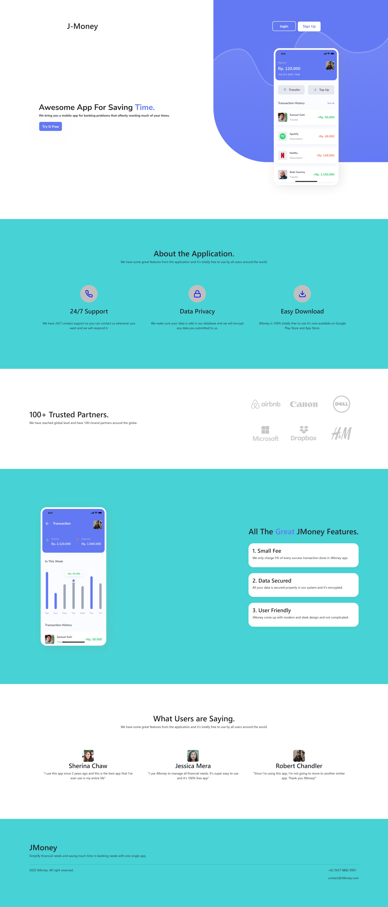
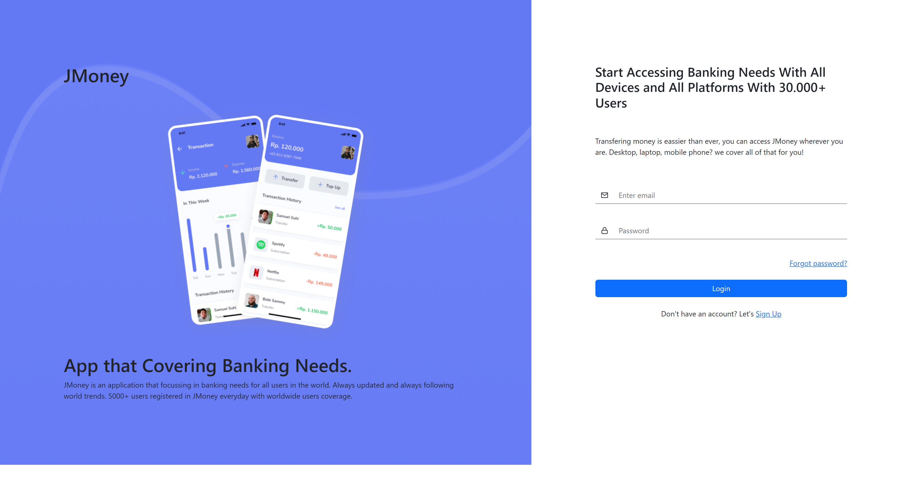
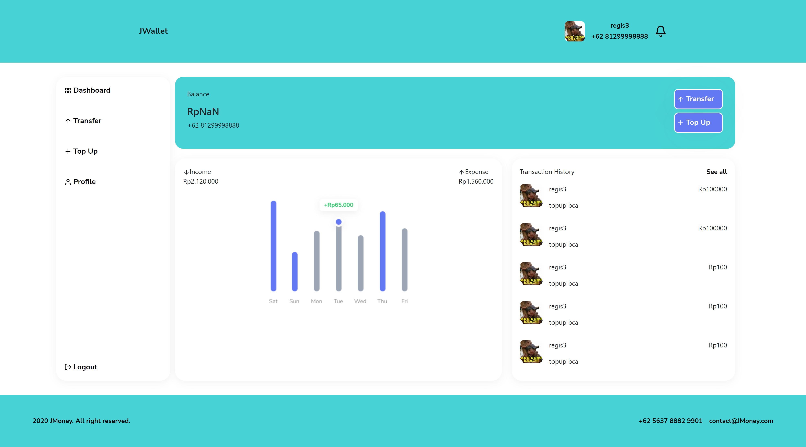
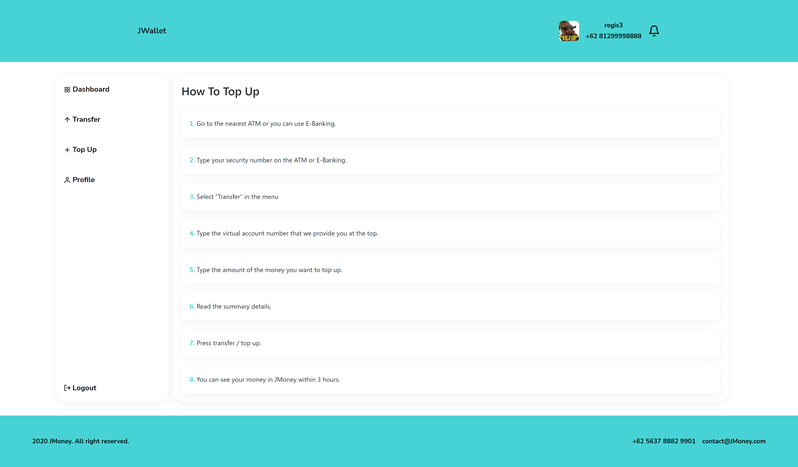
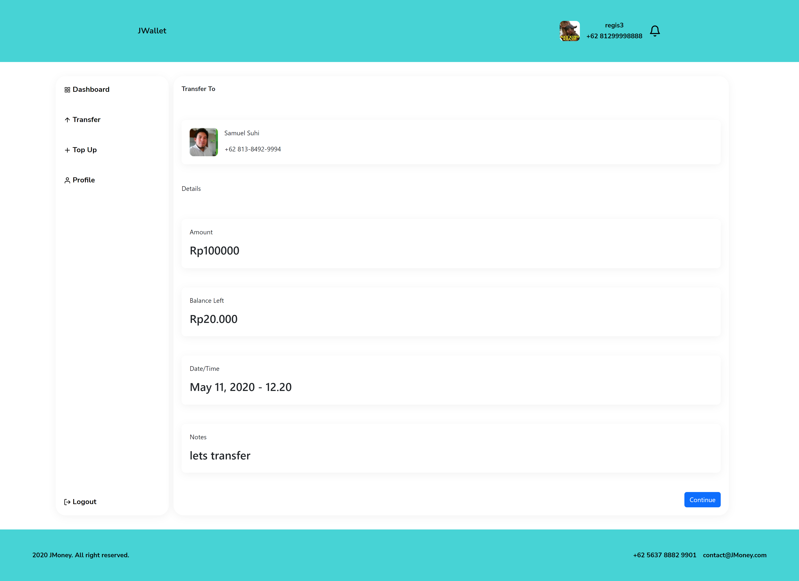

# REACT JS || J-Money
## About
#### E-wallet frontend app using reactjs
#
## Built With
#### [React](https://reactjs.org/) | [Bootstrap](https://getbootstrap.com/)
#### 
#
## Requirement
#### [Node Js](https://nodejs.org/)
#### Node_modules `npm i` or `yarn add`
#### Backend API [here](https://github.com/HimawanArifSM/fw9-backend)
#
## Get Start
#### 1. Clone this repo to your local computer or `git clone https://github.com/HimawanArifSM/fw9-reactjs-jigglingmoney`
#### 2. Open this project in your code editor and type `npm i` or `yarn add` in terminal
#### 3. Create .env file and fill write the code below
#### `REACT_APP_BACKEND_URL=http://localhost:3333`
#### 4. Run `npm start` or `yarn start` on terminal
#
## Acknowledgement
#### [Axios](https://axios-http.com/)
#### [Redux](https://redux.js.org/)
#### [React Redux](https://react-redux.js.org/)
#
## Screenshot

